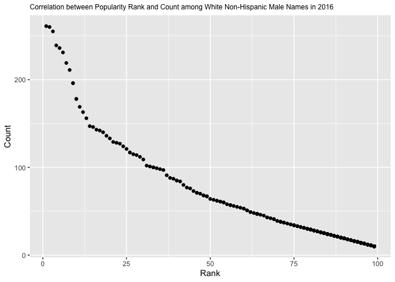

P8105 HW2 jl6046
================
Brian Jo Hsuan Lee
2021-10-07

Import packages

``` r
library(tidyverse)
library(readxl)
library(tidyr)
library(dplyr)
```

## Problem 1

Set Mr. Trash Wheel excel file path

``` r
trashwheel_path = "./hw2_files/Trash-Wheel-Collection-Totals-7-2020-2.xlsx"
```

Import and clean sheet “Mr. Trash Wheel” from the spreadsheet

``` r
tw_df = 
  read_excel(trashwheel_path, sheet = 1) %>%
  janitor::clean_names() %>%
  drop_na(dumpster) %>%
  mutate(
    sports_balls = round(sports_balls)
  )
```

Import, clean and combine sheets “2019 Precipitation” and “2019
Precipitation.”

``` r
prcp_2018_df = 
  read_excel(trashwheel_path, sheet = "2018 Precipitation", range = "A2:B14") %>%
  janitor::clean_names() %>%
  mutate(
    year = 2018
  )

prcp_2019_df = 
  read_excel(trashwheel_path, range = "2019 Precipitation!A2:B14") %>%
  janitor::clean_names() %>%
  drop_na(total) %>%
  mutate(
    year = 2019
  )

prcp_df =
  bind_rows(prcp_2018_df, prcp_2019_df) %>%
  mutate(
    month = month.name[month]
  )
```

There are 17 variables and 454 observations in the Mr. Trash Wheel data
frame, including information on dumpster IDs, dates, and the types and
weights of collected trash. On the other hand, the 2018 and 2019
precipitation data formed a 3 variable X 24 observation data frame,
where the dates and monthly precipitation were recorded.

The cells of annual precipitation were omitted when we read in the
spread sheets, but we may calculate it with the data we have. The total
precipitation in 2018 is 70.33.

``` r
aggregate(total ~ year, prcp_df, sum)
```

    ##   year total
    ## 1 2018 70.33
    ## 2 2019 33.95

Using the same method, we can acquire 9 as the median number of sports
balls from a dumpster in 2019.

``` r
aggregate(sports_balls ~ year, tw_df, median)
```

    ##   year sports_balls
    ## 1 2014            6
    ## 2 2015           16
    ## 3 2016           26
    ## 4 2017            8
    ## 5 2018            4
    ## 6 2019            9
    ## 7 2020           12
    ## 8 2021           12

## Problem 2

Set FiveThirtyEight comma-separated values file paths

``` r
pols_month_538_path = "./hw2_files/pols-month.csv"
unemployment_538_path = "./hw2_files/unemployment.csv"
snp_538_path = "./hw2_files/snp.csv"
```

Import and clean the 3 files separately as sub data frames before
merging

``` r
pols_df = 
  read_csv(pols_month_538_path) %>% 
  separate(col = mon, into = c('year', 'month', 'day'), sep = '-') %>% 
  mutate(
    month = month.name[as.numeric(month)],
    month = as.factor(month),
    month = ordered(month, levels = month.name)
  ) %>%
  pivot_longer(
    c(prez_gop, prez_dem),
    names_to = "president",
    names_prefix = "prez_",
    values_to = "president_TF"
  ) %>% 
  subset(president_TF == 1) %>% 
  select(- c(president_TF, day))
```

``` r
snp_df = 
  read_csv(snp_538_path) %>% 
  separate(col = date, into = c("month", "day", "year"), sep = "/") %>% 
  mutate(
    year = case_when(as.numeric(year) <= 15 ~ as.numeric(year) + 2000,
                     TRUE ~ as.numeric(year) + 1900), 
    year = as.character(year),
    month = month.name[as.numeric(month)],
    month = as.factor(month),
    month = ordered(month, levels = month.name)
  ) %>% 
  select(year, month, everything())
```

``` r
unemp_df = 
  read_csv(unemployment_538_path) %>%
  janitor::clean_names() %>% 
  pivot_longer(
    c(-year),
    names_to = "month",
    values_to = "unemp_rate"
  ) %>% 
  filter(!is.na(unemp_rate)) %>% 
  mutate(
    year = as.character(year),
    month = stringr::str_to_title(month),
    month = replace(month, month == month.abb[1], month.name[1]), 
    month = replace(month, month == month.abb[2], month.name[2]), 
    month = replace(month, month == month.abb[3], month.name[3]),
    month = replace(month, month == month.abb[4], month.name[4]), 
    month = replace(month, month == month.abb[5], month.name[5]), 
    month = replace(month, month == month.abb[6], month.name[6]),
    month = replace(month, month == month.abb[7], month.name[7]), 
    month = replace(month, month == month.abb[8], month.name[8]), 
    month = replace(month, month == month.abb[9], month.name[9]),
    month = replace(month, month == month.abb[10], month.name[10]), 
    month = replace(month, month == month.abb[11], month.name[11]), 
    month = replace(month, month == month.abb[12], month.name[12]),
    month = as.factor(month),
    month = ordered(month, levels = month.name)
  )
```

``` r
fivethirtyeight_df =
  full_join(pols_df, snp_df, by = c("year", "month")) %>%
  full_join(., unemp_df, by = c("year", "month")) %>% 
  arrange(year, month)
```

The three files recorded the state government and congress positions
held by the bipartisan government, S&P stock prices, and unemployment
rates from 1947 to 2015, forming a 12 variable X 823 observation data
frame as a result. The information could be helpful in studying the
relation between the ruling parties and the domestic economy upon
further analysis.

``` r
tail(fivethirtyeight_df, n = 5L)
```

    ## # A tibble: 5 × 12
    ##   year  month gov_gop sen_gop rep_gop gov_dem sen_dem rep_dem president day  
    ##   <chr> <ord>   <dbl>   <dbl>   <dbl>   <dbl>   <dbl>   <dbl> <chr>     <chr>
    ## 1 2015  March      31      54     245      18      44     188 dem       2    
    ## 2 2015  April      31      54     244      18      44     188 dem       1    
    ## 3 2015  May        31      54     245      18      44     188 dem       1    
    ## 4 2015  June       31      54     246      18      44     188 dem       1    
    ## 5 2015  July       NA      NA      NA      NA      NA      NA <NA>      1    
    ## # … with 2 more variables: close <dbl>, unemp_rate <dbl>

## Problem 3

Set Baby Names comma-separated values file path

``` r
baby_name_path = "./hw2_files/Popular_Baby_Names.csv"
```

Import and clean the GIGANTIC file

``` r
bn_df = 
  read_csv(baby_name_path) %>% 
  janitor::clean_names() %>% 
  mutate(
    gender = as.factor(gender),
    ethnicity = replace(ethnicity, ethnicity == "ASIAN AND PACI", "ASIAN AND PACIFIC ISLANDER"),
    ethnicity = replace(ethnicity, ethnicity == "BLACK NON HISP", "BLACK NON HISPANIC"),
    ethnicity = replace(ethnicity, ethnicity == "WHITE NON HISP", "WHITE NON HISPANIC"),
    ethnicity = as.factor(ethnicity),
    childs_first_name = toupper(childs_first_name)
  ) %>% 
  arrange(childs_first_name, gender, ethnicity) %>% 
  unite(count_rank, c(count, rank)) %>% 
  distinct() %>% 
  mutate(
    row = row_number()
  ) %>% 
  pivot_wider(
    names_from = year_of_birth,
    values_from = count_rank
  ) %>% 
  select(-row) %>% 
  group_by(childs_first_name, gender, ethnicity) %>% 
  fill(everything(), .direction = "up") %>% 
  # upgroup() %>% 
  distinct(childs_first_name, gender, ethnicity, .keep_all = TRUE) %>% 
  separate(col = "2016", into = c("2016_count", "2016_rank"), sep = "_") %>% 
  separate(col = "2015", into = c("2015_count", "2015_rank"), sep = "_") %>% 
  separate(col = "2014", into = c("2014_count", "2014_rank"), sep = "_") %>% 
  separate(col = "2013", into = c("2013_count", "2013_rank"), sep = "_") %>% 
  separate(col = "2012", into = c("2012_count", "2012_rank"), sep = "_") %>% 
  separate(col = "2011", into = c("2011_count", "2011_rank"), sep = "_") %>% 
  mutate_at("2016_count", as.character) %>% 
  mutate_at("2016_count", as.numeric) %>% 
  mutate_at("2015_count", as.character) %>% 
  mutate_at("2015_count", as.numeric) %>% 
  mutate_at("2014_count", as.character) %>% 
  mutate_at("2014_count", as.numeric) %>% 
  mutate_at("2013_count", as.character) %>% 
  mutate_at("2013_count", as.numeric) %>% 
  mutate_at("2012_count", as.character) %>% 
  mutate_at("2012_count", as.numeric) %>% 
  mutate_at("2011_count", as.character) %>% 
  mutate_at("2011_count", as.numeric) %>% 
  mutate_at("2016_rank", as.character) %>% 
  mutate_at("2016_rank", as.numeric) %>% 
  mutate_at("2015_rank", as.character) %>% 
  mutate_at("2015_rank", as.numeric) %>% 
  mutate_at("2014_rank", as.character) %>% 
  mutate_at("2014_rank", as.numeric) %>% 
  mutate_at("2013_rank", as.character) %>% 
  mutate_at("2013_rank", as.numeric) %>% 
  mutate_at("2012_rank", as.character) %>% 
  mutate_at("2012_rank", as.numeric) %>% 
  mutate_at("2011_rank", as.character) %>% 
  mutate_at("2011_rank", as.numeric) %>% 
  select(childs_first_name, gender, ethnicity, "2016_rank", "2016_count", "2015_rank", "2015_count", "2014_rank", "2014_count", "2013_rank", "2013_count", "2012_rank", "2012_count", "2011_rank", "2011_count")
```

I’m not sure why ungroup() here doesn’t work for me – The console would
throw an “upgroup() could not be found” error every time. I had hoped to
separate columns “childs\_first\_name”, “gender”, and “ethnicity” after
pivoting the data frame, but had no luck getting it to work even after I
had searched through the web for answers.

For years, “Olivia” was an extremely, if not the most, popular name
among Asian and Pacific Islanders as well as Non-Hispanic Whites. The
name was also common among Non-Hispanic Blacks and Hispanics. Inspect
the table for its popularity rankings from 2011 to 2016.

``` r
oliva_df = bn_df %>% 
  filter(
    childs_first_name == "OLIVIA"
  ) %>% 
  select(-c("2016_count", "2015_count", "2014_count", "2013_count", "2012_count", "2011_count"))

head(oliva_df)
```

    ## # A tibble: 4 × 9
    ## # Groups:   childs_first_name, gender, ethnicity [4]
    ##   childs_first_name gender ethnicity         `2016_rank` `2015_rank` `2014_rank`
    ##   <chr>             <fct>  <fct>                   <dbl>       <dbl>       <dbl>
    ## 1 OLIVIA            FEMALE ASIAN AND PACIFI…           1           1           1
    ## 2 OLIVIA            FEMALE BLACK NON HISPAN…           8           4           8
    ## 3 OLIVIA            FEMALE HISPANIC                   13          16          16
    ## 4 OLIVIA            FEMALE WHITE NON HISPAN…           1           1           1
    ## # … with 3 more variables: 2013_rank <dbl>, 2012_rank <dbl>, 2011_rank <dbl>

My approach for this question would be to compare the mean rankings
among male names, irregardless to their ethnicity stratification or
year, and assume the most popular names be those with the highest
unweighted ranking. However, I ran into trouble calculating their means.
My numeric observations, assuming they inherited their variables’
numeric qualities, could not be treated as inputs for mean() as
expected. Please advise if possible.

``` r
mn_df = bn_df %>% 
  filter(
    gender == "MALE"
  ) %>% 
  select(-c("2016_count", "2015_count", "2014_count", "2013_count", "2012_count", "2011_count")) %>% 
  rowwise() %>% 
  mutate(
    mean_rank = mean("2016_rank", "2015_rank", "2014_rank", "2013_rank", "2012_rank", "2011_rank")
  )
```

I ran into a similar issue here, where if I use the ‘numeric’ data
directly from the data frame the ggplot somehow treats it as a
non-quantitative variable, scattering it on a straight flat line. I
needed to create a separate data frame with new variables just to store
them for the scatter plot to work as intended.

``` r
mw2016_df = bn_df %>% 
  filter(
    gender == "MALE",
    ethnicity == "WHITE NON HISPANIC"
  ) %>% 
  select("2016_rank", "2016_count") %>% 
  drop_na("2016_rank")

Rank = pull(mw2016_df, "2016_rank")
Count = pull(mw2016_df, "2016_count")
scatter_df = data.frame(Rank, Count)

scatter_plot = 
  ggplot(scatter_df, aes(x = Rank, y = Count)) +
  geom_point() + 
  labs(title = "Correlation between Popularity Rank and Count among White Non-Hispanic Male Names in 2016") +
  theme(plot.title = element_text(size=9))

scatter_plot
```

<!-- -->

``` r
ggsave("Rank_v_Count", 
       plot = last_plot(),
       device = "pdf",
       path = "hw2_files"
       )
```
